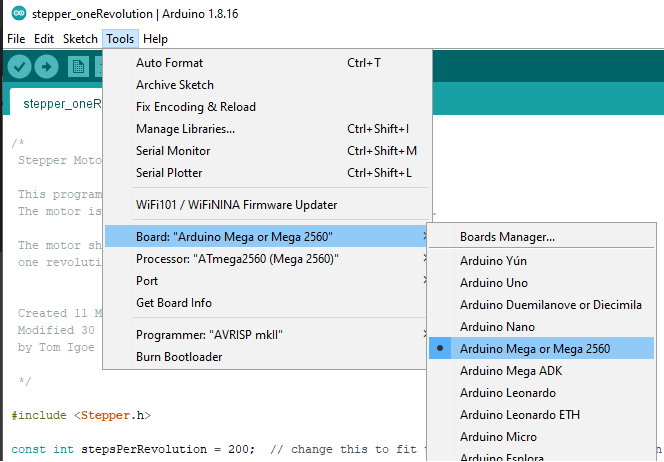

# Necesarry Libraries

* AccelStepper 1.61.0
* Gperser 1.0.0
* Rosserial Arduino Library 0.9.1

        Note: Rosserial need a small changes.
        40c40
        < #include <cstring>
        ---
        > #include <string.h>
        68c68
        <     std::memcpy(&val, &f, sizeof(val));
        ---
        >     memcpy(&val, &f, sizeof(val));
        182c182
        <     std::memcpy(f, &val, sizeof(val));
        ---
        >     memcpy(f, &val, sizeof(val));

        More info here: https://github.com/ros-drivers/rosserial/issues/518

# Stepper motor layout:
    Joint1  Black
    Joint2  Yellow
    Joint3  Red
    Joint4  Green

# Servo motor layout:
    Joint5  Blue
    Joint6  Yellow
    Gripper Green

# IDE settings
Set the board to Mega2560

Tools -> Board -> Arduino Mega or Mega 2560

